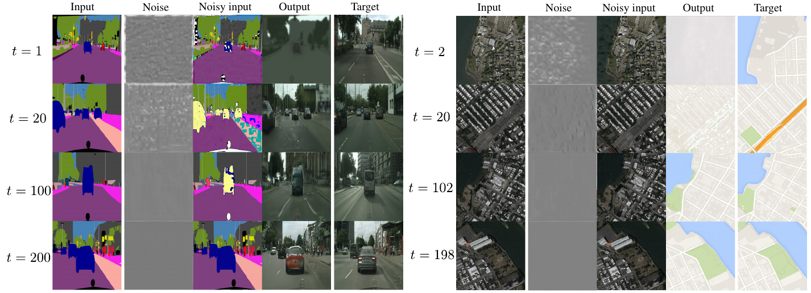

<!-- # ATME -->
# 

This repository is the official implementation of [Look ATME: The Discriminator Mean Entropy Needs Attention](https://arxiv.org/abs/2304.09024), accepted for the CVPR 2023 [Workshop on Generative Models for Computer Vision](https://generative-vision.github.io/workshop-CVPR-23/).

 

<br>

ATME is a GAN where, for each iteration at epoch $t$, the input images for the generator are corrupted with a noisy representation of the discriminator’s decision map at epoch $t − 1$. The adversarial game enforces this noise to be removed, sending the proper signals for equilibration by encouraging the discriminator to converge towards its maximum entropy state.

The implementation is based on the official [pix2pix](https://github.com/junyanz/pytorch-CycleGAN-and-pix2pix) pytorch code. Since it uses the UNet for denoising diffusion probabilistic models as generator, the corresponding module is borrowed from [lucidrains](https://github.com/lucidrains/denoising-diffusion-pytorch/blob/main/README.md).

## Requirements
First clone this repository:
```
git clone https://github.com/DLR-MI/atme.git
cd atme
```
and install suitable dependencies:
- For pip users, you need to `pip install -r requirements.txt`.
- For conda users `conda env create -f environment.yml` and `conda activate atme`.


## Datasets
To run the experiments in the paper, you first need to download the respective datasets. This can be done by running 
```
bash ./datasets/download_pix2pix_dataset.sh DATASET
```
where `DATASET` is any of `facades`, `maps`, `cityscapes`, or `night2day`. The result is placed in the dataroot folder `./datasets/DATASET`.

## Training
After downloading the dataset, decide on a project name (say `PROJECT`) and run

```
python train.py --name PROJECT --model atme --batch_size 48 --direction AtoB --dataroot ./datasets/DATASET
```
For multi-GPU training, add the option `--gpu_ids 0,1,2,3,...` to the command above.

In order to visualize intermediate results during the training process, you can either:
- run `python -m visdom.server` in a separate terminal, before the command above, and visit http://localhost:8097 afterwards, or
- check out `./checkpoints/PROJECT/web/index.html`. 

You should then see snapshots corresponding to $x$, $W_{t}$, $x_t$, $\hat{y}$, and $y$ in the paper, and named with the suffices real_A, Disc_B, noisy_A, fake_B and real_B, respectively. For other training arguments inherited from [pix2pix](https://github.com/junyanz/pytorch-CycleGAN-and-pix2pix), check out the modules in `./options`.

#### Train your own model
Since ATME is originally introduced for supervised image-to-image translation, you will need to create an aligned dataset suitable for your application. Once you have done that, there is some freedom to select your best model, in particular, by tweeking the generator. 

<p align="center">
  
</p>

The UNet comprising the generator in ATME has a default configuration ([lucidrains](https://github.com/lucidrains/denoising-diffusion-pytorch/blob/main/README.md)) consisting of an embedding dimension $d=64$ and attention resolutions $R=(1,2,4,8)$. In general, $R=(r_1, r_2, \cdots, r_H)$ represent the rates at which the feature maps grow during downsampling the input image through the UNet. That is, at the $i$-th layer, the number of feature maps go from $r_{i-1}d$ to $r_id$. You can vary the parameters $d$ and $R$ by using the arguments `--dim` and `--dim_mults`, respectively, in the training command above, e.g. `--dim 64 --dim_mults (1,2,4,8)` are the defaults. Such a variation is restricted by each $r_id$ being divisible by the number of groups `--groups` in the GroupNorm within each ResnetBlock, which defaults to `--groups 8`.

The supported arguments for the generator are
```commandline
--dim                        embedding dimension of the UNet (int)
--dim_mults                  attention resolutions (int)
--groups                     number of groups for GroupNorm within ResnetBlocks (int)
--init_dim                   number of output channels after initial conv2d of x_t (int)
--learned_sinusoidal_cond    learn fourier features for positional embedding? (bool)
--random_fourier_features    random fourier features for positional embedding? (bool)
--learned_sinusoidal_dim     twice the number of fourier frequencies to learn (int)
--time_dim_mult              dim * time_dim_mult: number of output channels after time-MLP (int)
```
By default, the positional embedding is carried out using fixed frequencies as in [Transformers](https://proceedings.neurips.cc/paper_files/paper/2017/file/3f5ee243547dee91fbd053c1c4a845aa-Paper.pdf).

## Evaluation
To test your model, just run
```
python test.py --name PROJECT --model atme --direction AtoB --dataroot ./datasets/DATASET
```
The results are placed in `./results/PROJECT`. Once there, you can compute the KID between real and generated images as
```
bash ./scripts/compute_kid.sh PROJECT
```

## Results
Besides obtaining state-of-the-art results in supervised image-to-image translation, at a lesser cost than popular GAN and diffusion models, our main contribution is allowing a GAN to converge towards the theoretical optimum, as observed in the figure below, where the GAN objective in ATME converges towards $-\log(4)$ on average. For discussion of the observed deviations take a look at the paper. 


<br>

You can get the data for such plots from `./checkpoints/PROJECT/loss_log.csv`, by adding `D_real` and `D_fake`, as per Eqs. (1) and (2) in the paper.

#### Is $W_t$ a Brownian motion?

The script for training now has an optional argument `n_save_noisy` to allow studying the properties of $D_t$ and $W_t$. The animation below shows the tendency of the (rescaled) $D_t$ towards a flat distribution for all entries, corresponding to the Nash equilibrium.
Take a look a the notebook `analyze_DW.ipynb` for experiments with the Maps dataset (in the direction AtoB) from which these results are obtained. You can find there some tests showing that $W_t$ behaves as a Brownian motion in a significant number of cases.

<table>
  <tr>
    <td style="text-align: center"></td>
    <td ></td>
  </tr>
  <tr>
    <td style="text-align: center"></td>
    <td style="text-align: center"></td>
  </tr>
</table>

## Things left to do:
- [x] Check if $W_t$ behaves as a Brownian motion.
- [ ] Ablation of block (f) in the paper and how it leads to failure modes during training.
- [ ] Ablation of block (g) in the paper and how it could generalize to different image resolutions.
- [ ]  Generalization of ATME to unsupervised image-to-image translation.

## Citation
```
@misc{solanocarrillo2023look,
      title={Look ATME: The Discriminator Mean Entropy Needs Attention}, 
      author={Edgardo Solano-Carrillo and Angel Bueno Rodriguez and Borja Carrillo-Perez and Yannik Steiniger and Jannis Stoppe},
      year={2023},
      eprint={2304.09024},
      archivePrefix={arXiv},
      primaryClass={cs.CV}
}
```